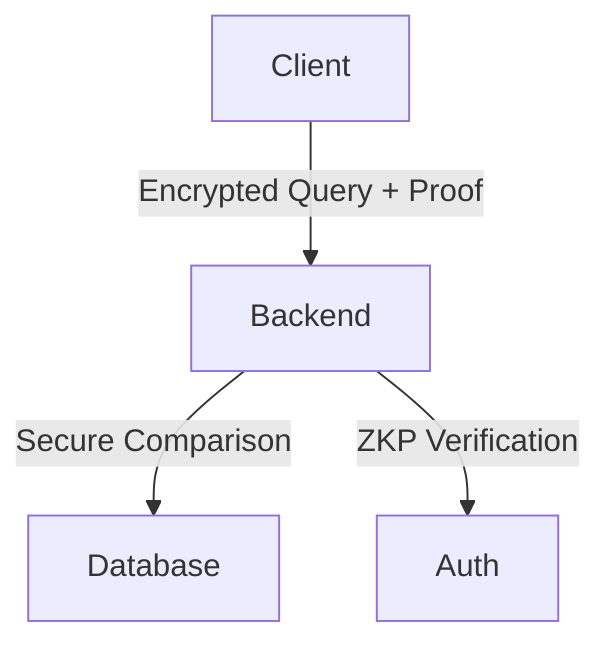

# Secure Crime Search System

A privacy-preserving crime record search system using Homomorphic Encryption and Zero-Knowledge Proofs (ZKP).

---

## Features

- 🔒 Encrypted query processing using CKKS homomorphic encryption  
- 🔐 Authentication with HMAC-based ZKP  
- 📊 Secure comparison without decrypting data  
- 🐳 Dockerized environment with PostgreSQL  
- 📈 Scalable architecture with separate backend/client services  

---

## Prerequisites

- Docker 20.10+  
- Docker Compose 2.17+  
- 4GB RAM available for Docker  
- (Optional) `curl` for API testing  

---

## Setup & Configuration

### 1. Clone Repository

```bash
git clone https://github.com/your-repo/secure-crime-search.git
cd secure-crime-search
```

### 2. Create Environment Files

**backend/.env**
```env
# Database
POSTGRES_DB=searchdb
POSTGRES_USER=user
POSTGRES_PASSWORD=secure_password
DB_HOST=db
DB_PORT=5432

# Encryption
CONTEXT_POLY_MOD_DEGREE=8192
CONTEXT_COEFF_MOD_BITS=60,40,40,60

# ZKP
ZKP_SECRET_KEY=super_secret_key_123
```

**client/.env**
```env
BACKEND_URL=http://backend:8000
OFFICER_ID=agent007
FLASK_SECRET_KEY=flask_secret_456
```

### 3. Prepare Data

Place your `crimes.csv` in the `data/` directory with the following format:

```csv
id,crime_type
1,murder
2,theft
...
```

---

## Timeout Counter & Usage Guide

Manage and test the system lifecycle and edge cases using the `run.sh` script.

### Initialize Database

```bash
./run.sh init
```

### Start Services

```bash
./run.sh up
# or simply
./run.sh
```

### Full Cleanup

```bash
./run.sh clean
```

### Show Help

```bash
./run.sh help
```

---

## Validation & Testing

### Missing CSV File

```bash
mv data/crimes.csv data/crimes.csv.bak
./run.sh init
# ✅ Should show a clear error about the missing CSV
```

### Simulate Database Timeout

```bash
# Temporarily set DB_TIMEOUT to a low value like 5 in .env
./run.sh init
# ⏱ Should show a timeout error
```

### Test Cleanup

```bash
./run.sh clean
# 🧹 Verify containers and volumes are removed
```

---

## Running the System

```bash
./run.sh
```

Services will be available at:
- **Client**: http://localhost:5000  
- **Backend**: http://localhost:8000  

---

## Testing the System

### Web Client
1. Open [http://localhost:5000](http://localhost:5000)  
2. Enter a crime type (e.g., "murder")  
3. View encrypted results  

### API Testing

```bash
# Step 1: Generate Proof
curl -X POST http://localhost:8000/search/generate-proof \
  -H "Content-Type: application/json" \
  -d '{"officer_id":"agent007", "query":"murder"}'

# Step 2: Perform Secure Search
curl -X POST http://localhost:8000/search \
  -H "Content-Type: application/json" \
  -d '{
    "officer_id": "agent007",
    "encrypted_query": "<base64_encrypted_query>",
    "proof": "<generated_proof>"
  }'
```

---

## Architecture



---

## Security Configuration

| Variable                  | Purpose                      | Recommended Setting     |
|---------------------------|------------------------------|--------------------------|
| `ZKP_SECRET_KEY`          | HMAC signing secret          | 64-byte random string    |
| `FLASK_SECRET_KEY`        | Client session security      | 32-byte random value     |
| `POSTGRES_PASSWORD`       | Database credentials         | 12+ char mixed case      |
| `CONTEXT_POLY_MOD_DEGREE` | Encryption security level    | 8192 (minimum secure)    |

---

## Troubleshooting

### Common Issues

1. **Database Connection Failures**
   - Verify matching `.env` values across backend and DB
   - Use: `docker-compose logs db`

2. **Encryption Errors**
   - Ensure consistent TenSEAL context
   - Verify base64 encoding of encrypted inputs

3. **ZKP Verification Failures**
   - Check container clock sync
   - Ensure HMAC secrets match across services

### Manual Cleanup

```bash
docker-compose down -v
```

---

